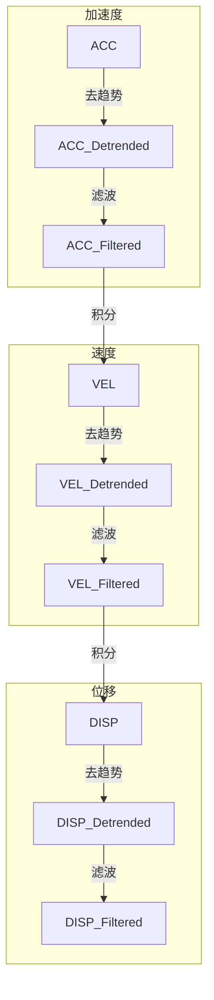

tags: #算法

# 思路
文昊算法

```mermaid
flowchart TD
	subgraph 加速度
		direction LR
		ACC -- 去趋势 --> ACC_Detrended
		ACC_Detrended -- 滤波 --> ACC_Filtered
	end
	subgraph 速度
		direction LR
		ACC_Filtered -- 积分 --> VEL
		VEL -- 去趋势 --> VEL_Detrended
		VEL_Detrended -- 滤波 --> VEL_Filtered
	end
	subgraph 位移
		direction LR
		VEL_Filtered -- 积分 --> DISP
		DISP -- 去趋势 --> DISP_Detrended
		DISP_Detrended -- 滤波 --> DISP_Filtered
	end
```

# 实现
已经在 [算法平台](http://suanfa.link) 中集成